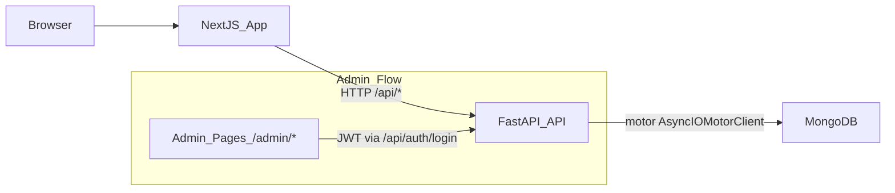

## 项目结构与数据流概览

- **后端（FastAPI + MongoDB）**
  - 核心入口：[backend/app/main.py](backend/app/main.py)
    - 使用 `lifespan` 在启动/关闭时调用 `connect_to_mongo` / `close_mongo_connection`，为全局 MongoDB 连接管理入口。
  - 配置与数据库
    - 配置：[backend/app/config.py](backend/app/config.py) — `Settings.mongodb_url` / `mongodb_database`，目前默认 `mongodb://localhost:27017`。
    - 数据库连接：[backend/app/database.py](backend/app/database.py) — 基于 `motor` 创建 `AsyncIOMotorClient`，`get_db()` 提供 `db` 实例。
  - 数据模型（Pydantic，用于接口 schema）
    - [backend/app/db_models.py](backend/app/db_models.py) — 定义 `Project`、`Skill`、`Profile`、`ContactSubmission` 结构（与 Mongo 文档结构对齐）。
  - 数据访问服务
    - 读： [backend/app/services/data_loader.py](backend/app/services/data_loader.py)
      - `load_projects` / `load_skills` / `load_profile` / `load_skills_grouped` / `get_project_by_slug_async` 均直接从 MongoDB 查询集合 `projects`、`skills`、`profiles`。
    - 写： [backend/app/services/data_writer.py](backend/app/services/data_writer.py)
      - `save_projects` / `save_skills` / `save_profile` / `save_contact_submission` 将数据写入 MongoDB，对应集合 `projects`、`skills`、`profiles`、`contact_submissions`。
      - `list_backups` / `restore_backup` 目前是为兼容旧 JSON 备份而保留的占位实现（返回空列表/False）。
  - 路由层（业务 API）
    - 项目：[backend/app/routers/projects.py](backend/app/routers/projects.py)
      - GET `/api/projects`：通过 `load_projects` 读取 Mongo 数据，并在内存层按 `category` / `featured` 再过滤。
      - GET `/api/projects/{slug}`：通过 `get_project_by_slug` 间接调用异步 Mongo 查询。
      - 管理端：POST/PUT/DELETE 尝试先 `load_projects()`（Mongo），在内存中修改列表后调用 `save_projects()` 覆盖集合。
      - 备份相关：`/admin/backups`、`/admin/restore` 仍提到 `projects.json`，但因 `data_writer` 中备份函数未实现，当前是「无效占位」。
    - 技能：[backend/app/routers/skills.py](backend/app/routers/skills.py)
      - GET `/api/skills`、`/grouped`、`/categories` 均从 Mongo 读取或在内存分组；Admin CRUD 同样走 `load_skills` + `save_skills`。
      - 备份接口与 JSON 文件类似，只是占位。
    - 个人资料：[backend/app/routers/profile.py](backend/app/routers/profile.py)
      - GET `/api/profile`：`load_profile()` 从 Mongo `profiles` 取第一条；若无则返回一份默认模板（"Your Name" 等占位文案）。
      - PUT `/api/profile`：`save_profile()` 写回 Mongo，并更新 `updated_at`。
      - 同样保留了基于 `profile.json` 的备份占位接口。
    - 联系表单：[backend/app/routers/contact.py](backend/app/routers/contact.py)
      - POST `/api/contact`：构造 `ContactSubmission`，调用 `save_contact_submission()` 写入 Mongo `contact_submissions`。
    - 认证：
      - [backend/app/routers/auth.py](backend/app/routers/auth.py) — 基于密码+JWT 的简单 Admin 登录，不依赖任何 JSON。
      - [backend/app/dependencies/auth.py](backend/app/dependencies/auth.py) — `get_current_user` 校验 JWT，保护 Admin 路由。
  - 迁移脚本
    - [backend/scripts/migrate_to_mongodb.py](backend/scripts/migrate_to_mongodb.py)
      - 从 `backend/app/data/{projects,skills,profile}.json` 读取，迁移到 Mongo，并在 `projects`/`skills`/`profiles`/`contact_submissions` 建索引。
      - 当前硬编码 `MONGODB_URL = "mongodb://111.231.68.34:27017"`（你选择以这个远程地址作为最终数据库）。
  - 旧/模拟数据
    - JSON 文件：[backend/app/data/profile.json](backend/app/data/profile.json)、[backend/app/data/projects.json](backend/app/data/projects.json)、[backend/app/data/skills.json](backend/app/data/skills.json) 及 `backend/app/data/backups/*`，现在仅被迁移脚本和文档引用，业务代码不再直接读取它们。
- **前端（Next.js App Router）**
  - 公共展示页（SSR/CSR 混合）
    - 首页：[frontend/app/page.tsx](frontend/app/page.tsx) — 通过 `fetchProjects` / `fetchSkills` 调用后端 `/api/projects`、`/api/skills`，展示精选项目与技能。
    - 项目列表与详情：[frontend/app/projects/page.tsx](frontend/app/projects/page.tsx)、[frontend/app/projects/[slug]/page.tsx](frontend/app/projects/%5Bslug%5D/page.tsx)
      - 列表页 client 组件，`fetchProjects` 获取数据并按分类筛选；详情页通过 `fetchProject` 和 `fetchProjects` 获取单个项目及相关项目。
    - 关于页：[frontend/app/about/page.tsx](frontend/app/about/page.tsx) — `fetchProfile` + `fetchSkillsGrouped`，展示个人简介、经历、教育和分组技能。
    - 联系页：[frontend/app/contact/page.tsx](frontend/app/contact/page.tsx) — `fetchProfile` 获取联系方式，`<ContactForm>` 通过 `submitContactForm` 调用后端 `/api/contact`。
  - API 客户端与类型
    - API 封装：[frontend/lib/api.ts](frontend/lib/api.ts)
      - 所有前台调用均通过 `API_BASE_URL = process.env.NEXT_PUBLIC_API_URL || "http://localhost:8000"` 拼接后端 `/api/*` 接口；无任何本地数组/模拟数据。
    - 类型定义：[frontend/lib/types.ts](frontend/lib/types.ts) — `Project`、`Skill`、`Profile` 等接口与后端返回结构对应。
  - 管理端（Admin）
    - 布局与鉴权：[frontend/app/admin/layout.tsx](frontend/app/admin/layout.tsx)
      - 基于 `localStorage.admin_token` 判定是否已登录，未登录时重定向 `/admin/login`；只负责前端路由保护，不涉及数据源。
    - 登录页：[frontend/app/admin/login/page.tsx](frontend/app/admin/login/page.tsx)
      - 直接调用 `${NEXT_PUBLIC_API_URL}/api/auth/login` 获取 JWT，存入 `localStorage.admin_token`。
    - Dashboard：[frontend/app/admin/page.tsx](frontend/app/admin/page.tsx)
      - 使用 `fetchProjects` / `fetchSkills` / `fetchProfile` 统计数量和基本信息，所有数据来自后端 API。
    - Profile 管理：[frontend/app/admin/profile/page.tsx](frontend/app/admin/profile/page.tsx)
      - 直接 `fetch("/api/profile")` + `PUT /api/profile`（带 `Authorization: Bearer <token>`），数据源为 Mongo。
    - Projects 管理：
      - 列表页：[frontend/app/admin/projects/page.tsx](frontend/app/admin/projects/page.tsx) — 通过 `fetch("/api/projects")`（携带 JWT）获取列表，支持删除（DELETE `/api/projects/{id}`）。
      - 新建/编辑页：[frontend/app/admin/projects/[id]/page.tsx](frontend/app/admin/projects/%5Bid%5D/page.tsx)
        - 若 `id === "new"` 则本地初始化空表单；否则先 `GET /api/projects` 获取全部项目并在前端查找对应 `id`，然后通过 `POST /api/projects` 或 `PUT /api/projects/{id}` 保存到 Mongo。
    - Skills 管理：
      - 列表页：[frontend/app/admin/skills/page.tsx](frontend/app/admin/skills/page.tsx) — `GET /api/skills` 获取列表，`DELETE /api/skills/{name}` 删除技能。
      - 新建/编辑页：[frontend/app/admin/skills/[id]/page.tsx](frontend/app/admin/skills/%5Bid%5D/page.tsx)
        - 类似项目，`GET /api/skills` 后在前端查找指定 `name`，通过 `POST /api/skills` 或 `PUT /api/skills/{name}` 写入 Mongo。

## 模拟数据与数据库的现状判断

- **后端真实数据源** 已经是 MongoDB：所有读写服务都通过 `get_db()` 操作 Mongo 集合；联系人提交、项目/技能/资料的 Admin CRUD 都更新数据库。
- **JSON 模拟数据** 仅存放于 `backend/app/data/*.json` 及 `backend/app/data/backups/`，不再被任何运行时代码读取；它们当前的角色：
  - 为迁移脚本提供来源（一次性导入数据到 Mongo）。
  - 为 README/ADMIN_GUIDE 提供旧版文档说明，但这与现状不符。
- **前端与管理端** 均通过 `frontend/lib/api.ts` 或显式 `fetch` 调用后端 `/api/*`，没有直接使用本地固定数组或 JSON 文件的逻辑。
- **备份相关接口** (`/admin/backups`、`/admin/restore`) 虽然还在路由里引用 `*.json` 文件名，但目前只是占位，前端也没有调用这些接口，对实际页面无影响。

基于你的选择：

- 数据库最终以 **远程 Mongo 地址 `mongodb://111.231.68.34:27017`** 为主（可以通过环境变量或配置统一）。
- 希望 **删除仓库中的 JSON 模拟数据**，只保留 MongoDB 作为唯一数据源。

## 实施方案：彻底切换到 MongoDB 并移除 JSON 模拟数据

### 步骤一：统一 MongoDB 连接配置，确保与远程库对齐

- **目标**：后端运行时统一使用你指定的远程 Mongo 实例，同时避免在多个文件里硬编码不同地址。
- **具体计划**：
  - 在部署环境/本地 `.env` 中设置：
    - `MONGODB_URL=mongodb://111.231.68.34:27017`
    - `MONGODB_DATABASE=portfolio`（保持与脚本一致）
  - 保持 [backend/app/config.py](backend/app/config.py) 中 `mongodb_url`/`mongodb_database` 从环境变量读取，以 `.env` 为准，而不在代码中直接写死 IP。
  - 调整 [backend/scripts/migrate_to_mongodb.py](backend/scripts/migrate_to_mongodb.py)：
    - 将 `MONGODB_URL` 和 `DB_NAME` 改为从环境变量或复用 `Settings` 读取，保证迁移脚本与应用本身指向同一个 Mongo 实例。
  - 启动 FastAPI 时，通过日志或临时健康检查接口（已有 `/health`）确认能连接到远程 Mongo，并确保 `db` 非空。

### 步骤二：使用迁移脚本将 JSON 数据完整导入远程 Mongo

- **目标**：在删除本地 JSON 之前，确保远程 Mongo 中已经包含完整的项目、技能、个人资料和原有联系人数据。
- **具体计划**：
  - 在迁移前，确认当前 Mongo 中是否已有数据：
    - 使用脚本中 `db.projects.count_documents({})` 等检查；若已有数据，按脚本已有提示决定是否覆盖（或先做 MongoDB 自身的备份）。
  - 在已经指向远程地址的前提下运行 [backend/scripts/migrate_to_mongodb.py](backend/scripts/migrate_to_mongodb.py)：
    - `migrate_projects`：从 `app/data/projects.json` 读取 `projects` 数组，补充 `created_at`/`updated_at` 后写入 `projects` 集合。
    - `migrate_skills`：从 `app/data/skills.json` 读取 `skills` 数组，写入 `skills` 集合。
    - `migrate_profile`：从 `app/data/profile.json` 读取单个对象，写入 `profiles` 集合。
    - （如存在）`contact_submissions.json` 也会导入到 `contact_submissions` 集合并修正时间格式。
    - 最后执行 `create_indexes`，在 Mongo 上创建必要索引（slug/name/category/featured/submitted_at）。
  - 使用 Mongo 客户端（如 Compass、命令行或简单测试 API）检查：
    - `projects`、`skills`、`profiles`、`contact_submissions` 集合中的文档数量与 JSON 源基本一致。

### 步骤三：删除 JSON 模拟数据及相关备份文件

- **目标**：从代码仓库中移除所有 JSON 模拟数据文件，避免未来维护时产生「以为还在用 JSON 存储」的误解。
- **需要删除的文件/目录**：
  - `backend/app/data/profile.json`
  - `backend/app/data/projects.json`
  - `backend/app/data/skills.json`
  - 如存在：`backend/app/data/contact_submissions.json`
  - 整个备份目录：`backend/app/data/backups/` 下的所有 `.bak`/`.json` 文件
- **代码上的微调**（可选但推荐）：
  - 在 [backend/app/services/data_writer.py](backend/app/services/data_writer.py) 中：
    - 保留 `list_backups` / `restore_backup` 的定义，但在文档字符串中明确标注「当前未实现，返回空」，避免开发者误用。
  - 在 [backend/app/routers/{projects,skills,profile}.py](backend/app/routers) 中的备份相关路由：
    - 可以暂时保留（前端未引用，不影响功能），或在未来需要时改造为真正的 MongoDB 备份/恢复方案（例如对接 `mongodump` / `mongorestore`）。

### 步骤四：更新文档，去除 JSON 存储的表述

- **目标**：让 README 和管理文档反映「数据库即真相」，不再误导为「数据存储在 JSON 文件」。
- **具体计划**：
  - 修改 [README.md](README.md)：
    - 将「项目数据以 JSON 格式存储在 `backend/app/data/` 目录」相关段落替换为：
      - 描述 MongoDB 作为主数据源，列出使用的集合（projects、skills、profiles、contact_submissions）。
      - 简要介绍 `migrate_to_mongodb.py` 仅用于初始化/迁移旧 JSON 数据。
  - 修改 [ADMIN_GUIDE.md](ADMIN_GUIDE.md)：
    - 将“进入 `backend/app/data/backups/` 目录进行 JSON 备份/恢复”的说明改为：
      - 说明当前版本的备份接口尚未实现，仅依赖 MongoDB 自身的备份方案（例如 `mongodump`）。
      - 如有需要，可简单列出建议的 MongoDB 备份命令（不必在本次改动中实现自动化）。

### 步骤五：前后端配置对齐并验证所有页面/管理功能

- **目标**：确保前端展示页和管理端都通过统一的 API 与远程 MongoDB 通信，移除 JSON 后功能完全正常。
- **具体计划**：
  - **环境变量对齐**：
    - 在前端环境中配置 `NEXT_PUBLIC_API_URL` 指向部署好的 FastAPI 后端地址（如 `https://your-api-domain` 或 `http://your-server-ip:8000`）。
    - 保证这个地址与后端连接的 Mongo 实例（你指定的 `mongodb://111.231.68.34:27017`）是同一环境的一部分。
  - **功能回归检查（前台）**：
    - 首页：确认精选项目、技能均正常展示；无 500/404 错误。
    - `/projects` 列表 + `/projects/[slug]` 详情：项目数据与 Mongo 中一致，分类过滤和「相关项目」逻辑正常工作。
    - `/about`：个人简介、经历、教育和技能分组内容来自 Mongo，并与 Admin 中编辑的内容保持同步。
    - `/contact`：通过表单发送消息时后端成功写入 `contact_submissions`，前端显示成功提示。
  - **功能回归检查（Admin 管理端）**：
    - `/admin/login`：能使用配置中的密码成功登录，获取 `admin_token`。
    - `/admin` Dashboard：项目数、精选项目数、技能数、Profile 名称正确反映 Mongo 中数据。
    - `/admin/profile`：编辑并保存 Profile 后，刷新 `/about` 页面能看到最新信息。
    - `/admin/projects` & `/admin/projects/new` / `/admin/projects/[id]`：
      - 新增、编辑、删除项目均能正确反映到 `/projects` 列表和详情页上。
    - `/admin/skills` & `/admin/skills/new` / `/admin/skills/[id]`：
      - 新增、编辑、删除技能能正确影响首页/关于页的技能展示。
  - **确认无遗留模拟数据路径**：
    - 用简单搜索确认前后端不再引用 `backend/app/data` 路径，也没有硬编码的项目/技能数组。

## 简要架构示意（数据流）

- **含义**：所有展示页面与 Admin 管理界面都通过同一套 `/api/`* 接口访问 FastAPI 服务，FastAPI 再统一通过 MongoDB 读写数据；本次改造的核心就是删除 JSON 模拟数据、统一 MongoDB 配置，并验证这一数据流在所有页面中正常工作。

